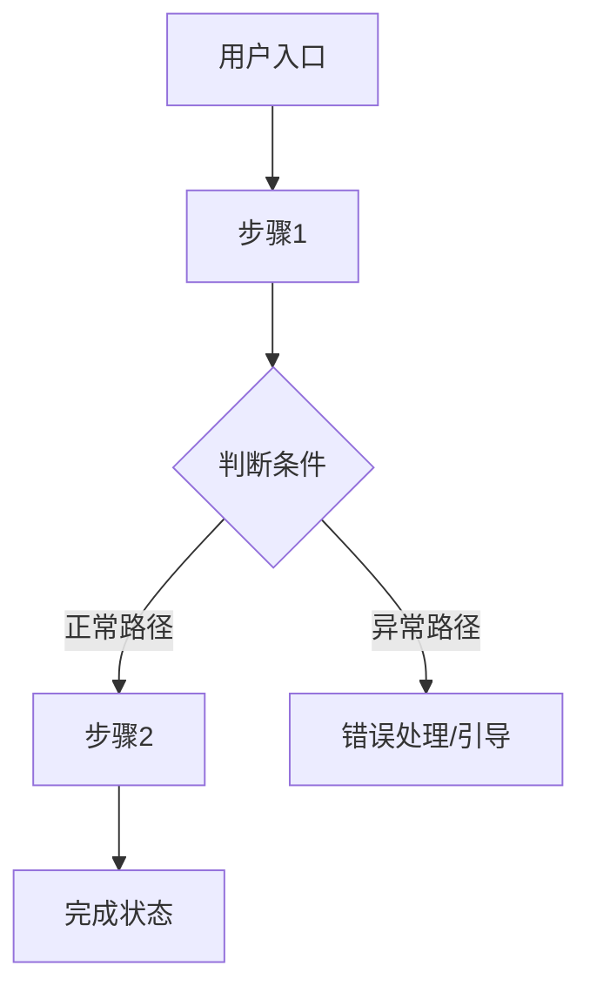

# 传统应用 · 落地需求文档章节模板

本文件定义传统应用（无 AI 能力）的落地需求文档章节结构。由 SKILL.md 在第三步根据产品类型分发到此。

页面布局的 ASCII 线框图模板请参考 `page-type-templates.md`。

---

## 1. 产品概述

从第一版概念文档继承，直接复用，不重复追问。

---

## 2. 目标用户与使用场景

- 用户画像（从概念版展开，加入更多细节）
- 典型使用场景（列举 2-3 个具体场景，要有「谁在什么情况下用，做什么动作，期望得到什么结果」）

---

## 3. 用户故事

按功能模块组织用户故事，使用标准格式：

```
作为【用户角色】
在【XX 使用场景】下，
为了【达成 XX 目标 / 解决 XX 问题】
需要【功能 XX 支持 / 具备 XX 能力】。
```

每个用户故事包含：
- 用户故事描述
- 验收标准
- 技术实现要点

---

## 4. 核心用户动线

用 Mermaid 流程图输出，至少覆盖主流程 + 1-2 个异常分支（比如失败了怎么办、没权限怎么处理）。



---

## 5. 功能清单

树状结构，用优先级标注：🔴 核心 / 🟡 重要 / ⚪ 未来规划。

```
产品名称
├── 🔴 模块A（核心，MVP 必须有）
│   ├── 功能1
│   └── 功能2
├── 🟡 模块B（重要，后续迭代）
│   └── 功能3
└── ⚪ 模块C（未来规划，暂不实现）
    └── 功能4
```

---

## 5.1 关键页面布局线框图

选取产品中**最核心的页面**，用 ASCII 线框图展示其整体布局结构。目的是让开发者和设计师在动手之前，对页面骨架有一致的理解。

**选哪个页面？** 选用户最常停留的那个页面，或产品最核心的交互发生在哪里，就画哪个。核心页面都要画。

**根据页面类型选择对应的模板格式。** 参考 `page-type-templates.md`。

每个页面的线框图需要体现：
- 导航栏的位置和方向（顶部横向、左侧竖向、底部 Tab）
- 页面各区域的划分（主内容区、操作栏、辅助信息）
- 视觉重心——哪个区域是用户最先注意到的、需要强调的
- 是否有弹窗、抽屉、侧边面板等覆盖层元素

**输出格式：** 用 ASCII 字符画出页面骨架，用文字标注各区域的名称和作用。

---

## 6. 功能详细描述

每个 🔴 核心功能单独写一节，不能合并，不能省略。

> **为什么要这么细？**
> 这份文档有两个读者：一个是 AI/开发者（需要准确的技术规格），一个是你自己在验收时用（需要能对照检查）。信息不完整的文档，交给 AI 实现时会产生大量「自由发挥」，结果往往和预期不一样。

根据功能对应的页面类型，参考 `page-type-templates.md` 中对应类型的模板来组织内容。每个功能页面至少包含：页面概述、页面布局（ASCII 线框图）、功能点说明、数据字段定义、交互说明、异常处理、性能要求。

---

### 6.x 功能名称

**功能描述**：这个功能解决什么问题，核心逻辑是什么。

**触发条件**：用户在什么情况下进入/触发这个功能。

**交互细节**（非 PM 用户通常不会主动想到这些，必须主动补全）：

| 场景 | 交互处理方式 |
|------|------------|
| 操作反馈 | 用户触发操作后立即看到什么？（loading / toast / 弹窗 / 骨架屏） |
| 危险操作确认 | 删除/不可逆操作是否需要二次确认弹窗？确认文案是什么？ |
| 空状态引导 | 用户第一次进来没有数据时，看到什么？有没有引导去做第一步？ |
| 操作失败引导 | 操作失败时，除了报错，还告诉用户下一步怎么做？ |

**状态清单**（对每个核心交互元素，列出所有可能的状态）：

| 状态 | 触发条件 | UI 表现 | 用户可执行操作 |
|------|---------|---------|-------------|
| 默认 | 页面加载完成 | | |
| 加载中 | 用户触发操作后 | 转圈/骨架屏/进度条 | 不可重复触发 |
| 成功 | 操作完成 | 成功提示 + 更新内容 | |
| 失败 | 接口报错或操作失败 | 红色提示 + 重试选项 | 重试/修改后重试 |
| 禁用 | 无权限或条件不满足 | 灰色 + tooltip 说明原因 | 仅查看，不可操作 |
| 空状态 | 无数据时 | 空状态插图 + 引导文案 + 操作按钮 | 引导去做第一步 |

**边界条件**（逐一列出，不能省略）：

- 内容为空时：
- 内容超长时（字数上限/文件大小上限）：
- 网络异常或请求超时时：
- 无权限时：
- 并发操作时（多人同时操作同一条数据）：
- 数据格式不符时：

**多种内容类型展示规范**（如功能涉及多种内容类型，分别描述）：

| 内容类型 | 展示方式 | 特殊交互 | 加载/失败处理 |
|---------|---------|---------|------------|
| 图片 | 缩略图 + 点击放大 | 支持拖拽排序 | 显示破图占位图 |
| PDF | 图标 + 文件名 + 文件大小 | 点击预览或下载 | 显示下载失败提示 |
| 链接 | URL 卡片预览（标题+描述+图标） | 点击跳转新标签 | 显示原始 URL |
| 视频 | 封面图 + 时长 | 点击播放 | 显示视频加载失败 |

**数据规范**（非 PM 用户通常不会想到这些，必须主动补全）：

| 字段名 | 数据类型 | 长度/大小限制 | 是否必填 | 默认值 | 格式要求 | 校验规则 |
|------|--------|------------|--------|------|--------|--------|
| | | | | | | |

---

## 7. 文案规范

> 标准模式可省略本章节。完整模式必须包含。

> **这一节服务于两个不同的对象，必须分开定义，不能混在一起。**

**7.1 产品整体文案风格定义**

先确定风格基调——所有面向用户的文案都要符合这个基调，保持一致性。

风格选项（从中选一个，或描述自己的风格）：
- 专业严谨（适合 To B 工具、金融类产品）
- 亲切友好（适合 To C 消费类产品）
- 简洁直接（适合效率工具类产品）
- 轻松有趣（适合年轻用户、娱乐类产品）

**7.2 面向开发/AI 的字段描述**

技术侧的字段说明，准确优先，已在「数据规范」部分覆盖，无需重复。

**7.3 面向终端用户的产品文案**

这些文案会直接出现在用户界面上，风格要符合 7.1 定义的基调，并且：
- 按钮文案：动词开头，简洁明确（✅「开始创建」❌「确认」）
- 错误提示：说明原因 + 给出下一步操作（✅「上传失败，文件大小超过 10MB，请压缩后重试」❌「上传失败」）
- 空状态文案：引导性，给用户信心和行动方向

| 场景 | 文案内容 | 风格备注 |
|------|---------|---------|
| 页面标题 | | 符合产品风格基调 |
| 空状态标题 + 说明 + 按钮 | | 引导性，不要让用户感到迷茫 |
| 按钮文字 | | 动词开头，简洁 |
| 成功提示 | | 正向反馈，给用户信心 |
| 错误提示 | | 说明原因 + 给出下一步 |
| 加载中提示 | | 让用户知道系统在工作中 |
| 危险操作确认弹窗 | | 清楚说明操作后果，避免误操作 |

---

## 8. 异常处理与降级策略

- 网络异常时的用户提示和重试机制
- 服务端错误时的降级展示
- 数据加载失败时的缓存策略

---

## 9. 非功能性需求

- **性能要求**：页面首屏加载时间、核心接口响应时间要求（例：首屏 < 2s，接口 < 500ms）
- **权限控制**：哪些功能需要登录才能使用，是否有角色权限区分
- **兼容性**：支持的设备（移动端/桌面端）、浏览器版本、操作系统版本
- **数据安全**：敏感数据的处理方式（加密存储、传输方式）
- **数据存储**：数据保留时长、单用户/全平台存储容量限制

---

## 10. 测试标准

> 标准模式可省略本章节。完整模式必须包含。

- **功能测试标准**：核心功能的验收标准（基于用户故事和验收标准）
- **性能测试标准**：响应时间、并发能力等量化指标
- **用户体验测试标准**：用户满意度、易用性等指标
- **线上监控指标**：上线后需要持续监控的关键指标

---

## 11. 迭代规划

> 标准模式可省略本章节。完整模式必须包含。

- MVP 版本包含哪些功能（🔴 核心功能）
- V1.1 版本计划（🟡 重要功能）
- 长期规划方向（⚪ 未来规划）
- 关键里程碑和预计时间节点

---

## 12. 待确认问题

- [ ] 问题 1（标明这个问题不确定会影响哪个功能）
- [ ] 问题 2
